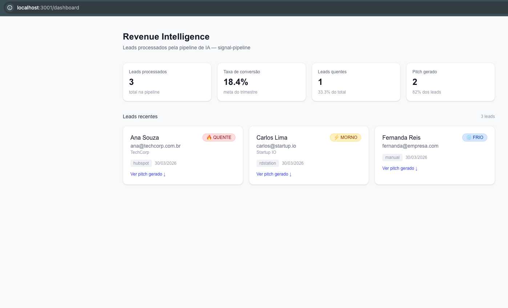

# signal-pipeline

> Pipeline de inteligência de vendas orientada a eventos — processa interações brutas de CRM, classifica intenção de compra com IA e gera pitches personalizados automaticamente.



## O problema que resolve

Times de vendas B2B perdem horas lendo e-mails, transcrições de reuniões e tickets de CRM para descobrir quem está pronto para comprar. O signal-pipeline ingere esses dados desestruturados, processa com uma arquitetura RAG multi-agente e entrega temperatura do lead + pitch de fechamento em segundos.

## Arquitetura
```
CRM / Webhook
     │
     ▼
┌─────────────────────────────┐
│  API  (Node.js + TypeScript) │  ← valida payload, publica na fila
│  Express · Zod · Helmet      │
└────────────┬────────────────┘
             │ AMQP
             ▼
┌─────────────────────────────┐
│     RabbitMQ (Docker)        │  ← fila durável lead.ingest
└────────────┬────────────────┘
             │ consume
             ▼
┌─────────────────────────────┐
│  Worker  (Python)            │  ← ETL + embeddings + agentes
│  LangChain · OpenAI · pika   │
│  ┌──────────────────────┐   │
│  │ ETL: clean + chunk   │   │
│  │ Embeddings (ada-002) │   │
│  │ Agente 1: classifier │   │
│  │ Agente 2: pitcher    │   │
│  └──────────────────────┘   │
└────────────┬────────────────┘
             │ INSERT
             ▼
┌─────────────────────────────┐
│  PostgreSQL + pgvector       │  ← armazena leads, embeddings, pitches
└─────────────────────────────┘
             │
             ▼
┌─────────────────────────────┐
│  Web  (Next.js + Tailwind)   │  ← dashboard Revenue Intelligence
└─────────────────────────────┘
```

## Stack

| Camada | Tecnologia | Decisão |
|---|---|---|
| API / Ingestão | Node.js + TypeScript + Express | I/O não-bloqueante para alta concorrência no webhook |
| Mensageria | RabbitMQ | Desacopla ingestão do processamento; garante durabilidade das mensagens |
| ETL + IA | Python + LangChain + OpenAI | Ecossistema maduro para data science e orquestração de agentes |
| Banco vetorial | PostgreSQL + pgvector | SQL familiar + busca semântica sem infra adicional |
| Dashboard | Next.js + TailwindCSS | SSR nativo + produtividade de estilo |
| Infra | Docker Compose | Ambiente reproduzível com um único comando |

## Por que Node.js na borda e Python no core?

Node.js foi escolhido para a camada de ingestão por seu modelo de I/O não-bloqueante — ideal para um webhook que precisa responder em < 50ms sem segurar thread. Python assumiu o core de IA por razões práticas: LangChain, pgvector, e o ecossistema de embeddings têm suporte de primeira classe em Python. Separar os dois serviços permite escalar cada um de forma independente — o worker pode ter mais réplicas em picos de processamento sem afetar a latência da API.

## Estrutura do repositório
```
signal-pipeline/
├── api/                  # Node.js — webhook receiver
│   ├── src/
│   │   ├── routes/       # webhook.ts
│   │   ├── services/     # publisher.ts (RabbitMQ)
│   │   ├── middleware/   # validatePayload.ts (Zod)
│   │   └── types/        # lead.ts
│   └── Dockerfile
├── worker/               # Python — ETL + agentes de IA
│   ├── src/
│   │   ├── etl/          # processor.py (clean, chunk, embed)
│   │   ├── agents/       # classifier.py + pitcher.py
│   │   └── services/     # consumer.py + database.py
│   └── Dockerfile
├── web/                  # Next.js — dashboard
│   └── app/dashboard/
├── infra/
│   └── postgres/init.sql # schema + extensão pgvector
├── docs/
│   └── ADR-001-node-python-split.md
└── docker-compose.yml
```

## Como rodar

### Pré-requisitos

- Docker e Docker Compose instalados
- Chave de API da OpenAI

### 1. Clone e configure o ambiente
```bash
git clone https://github.com/vysdg/signal-pipeline.git
cd signal-pipeline
cp .env.example .env
# edite o .env e adicione sua OPENAI_API_KEY
```

### 2. Suba toda a infra
```bash
docker compose up --build
```

Isso inicializa:
- PostgreSQL com pgvector na porta 5432
- RabbitMQ na porta 5672 (management UI em :15672)
- API Node.js na porta 3000
- Worker Python consumindo a fila
- Dashboard Next.js na porta 3001

### 3. Envie um lead de teste
```bash
curl -X POST http://localhost:3000/api/webhook/lead \
  -H "Content-Type: application/json" \
  -d '{
    "source": "hubspot",
    "contact": {
      "name": "Ana Souza",
      "email": "ana@techcorp.com.br",
      "company": "TechCorp"
    },
    "raw_text": "Oi, vi a demo de vocês na RD Summit. Estamos com uma meta agressiva esse trimestre e precisamos fechar uma ferramenta de qualificação de leads até o fim do mês. Qual o prazo de implementação e existe um plano anual com desconto?"
  }'
```

Resposta esperada:
```json
{ "status": "queued", "message": "Lead accepted and queued for processing" }
```

### 4. Acesse o dashboard
```
http://localhost:3001/dashboard
```

## Decisões de arquitetura

Documentadas em [`docs/ADR-001-node-python-split.md`](./docs/ADR-001-node-python-split.md)

## Melhorias planejadas

- Autenticação JWT no webhook (HMAC signature validation)
- Endpoint REST para busca semântica por similaridade de leads
- Testes de integração com Vitest (API) e pytest (worker)
- Monitoramento com Prometheus + Grafana
- CI/CD com GitHub Actions
- Rate limiting por origem no webhook

## Autor

Desenvolvido por [vysg](https://github.com/vysdg) como projeto de portfólio técnico demonstrando arquitetura orientada a eventos, microsserviços e IA aplicada a revenue intelligence.
