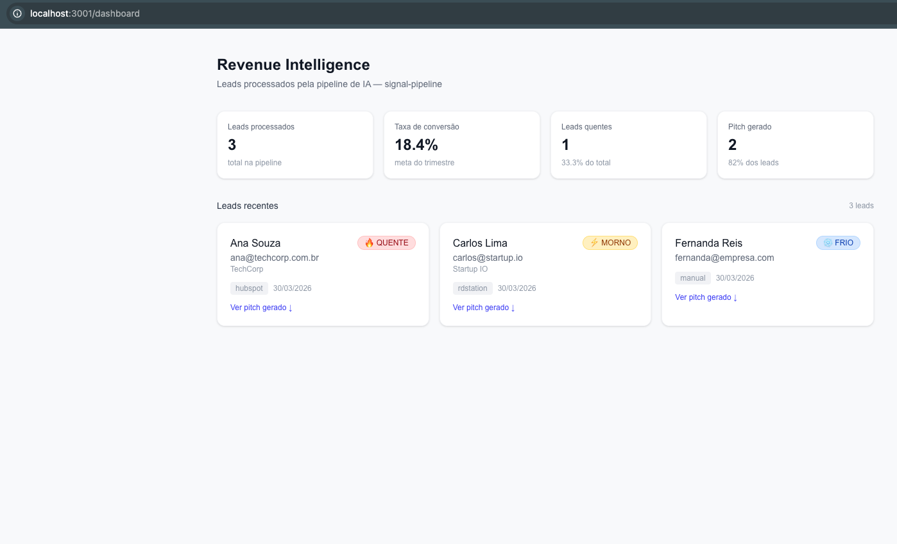

# signal-pipeline

[](https://github.com/vysdg/signal-pipeline/actions/workflows/ci.yml)

> Pipeline de inteligência de vendas orientada a eventos — processa interações brutas de CRM, classifica intenção de compra com IA e gera pitches personalizados automaticamente.



## O problema que resolve

Times de vendas B2B perdem horas lendo e-mails, transcrições de reuniões e tickets de CRM para descobrir quem está pronto para comprar. O signal-pipeline ingere esses dados desestruturados, processa com uma arquitetura RAG multi-agente e entrega temperatura do lead + pitch de fechamento em segundos.

## Arquitetura
```
CRM / Webhook
     │
     ▼
┌─────────────────────────────┐
│  API  (Node.js + TypeScript) │  ← valida payload, publica na fila
│  Express · Zod · Helmet      │
└────────────┬────────────────┘
             │ AMQP
             ▼
┌─────────────────────────────┐
│     RabbitMQ (Docker)        │  ← fila durável lead.ingest
└────────────┬────────────────┘
             │ consume
             ▼
┌─────────────────────────────┐
│  Worker  (Python)            │  ← ETL + embeddings + agentes
│  LangChain · OpenAI · pika   │
│  ┌──────────────────────┐   │
│  │ ETL: clean + chunk   │   │
│  │ Embeddings (ada-002) │   │
│  │ Agente 1: classifier │   │
│  │ Agente 2: pitcher    │   │
│  └──────────────────────┘   │
└────────────┬────────────────┘
             │ INSERT
             ▼
┌─────────────────────────────┐
│  PostgreSQL + pgvector       │  ← armazena leads, embeddings, pitches
└─────────────────────────────┘
             │
             ▼
┌─────────────────────────────┐
│  Web  (Next.js + Tailwind)   │  ← dashboard Revenue Intelligence
└─────────────────────────────┘
```

## Stack

| Camada | Tecnologia | Decisão |
|---|---|---|
| API / Ingestão | Node.js + TypeScript + Express | I/O não-bloqueante para alta concorrência no webhook |
| Mensageria | RabbitMQ | Desacopla ingestão do processamento; garante durabilidade das mensagens |
| ETL + IA | Python + LangChain + OpenAI | Ecossistema maduro para data science e orquestração de agentes |
| Banco vetorial | PostgreSQL + pgvector | SQL familiar + busca semântica sem infra adicional |
| Dashboard | Next.js + TailwindCSS | SSR nativo + produtividade de estilo |
| Infra | Docker Compose | Ambiente reproduzível com um único comando |

## Por que Node.js na borda e Python no core?

Node.js foi escolhido para a camada de ingestão por seu modelo de I/O não-bloqueante — ideal para um webhook que precisa responder em < 50ms sem segurar thread. Python assumiu o core de IA por razões práticas: LangChain, pgvector, e o ecossistema de embeddings têm suporte de primeira classe em Python. Separar os dois serviços permite escalar cada um de forma independente — o worker pode ter mais réplicas em picos de processamento sem afetar a latência da API.

## Estrutura do repositório
```
signal-pipeline/
├── api/                  # Node.js — webhook receiver
│   ├── src/
│   │   ├── routes/       # webhook.ts
│   │   ├── services/     # publisher.ts (RabbitMQ)
│   │   ├── middleware/   # validatePayload.ts (Zod) + verifySignature.ts (HMAC)
│   │   │   └── __tests__/# Vitest
│   │   └── types/        # lead.ts
│   └── Dockerfile
├── worker/               # Python — ETL + agentes de IA
│   ├── src/
│   │   ├── etl/          # processor.py (clean, chunk, embed)
│   │   ├── agents/       # classifier.py + pitcher.py
│   │   └── services/     # consumer.py + database.py
│   ├── tests/            # pytest
│   └── Dockerfile
├── web/                  # Next.js — dashboard
│   └── app/dashboard/
├── infra/
│   └── postgres/init.sql # schema + extensão pgvector
├── docs/
│   └── ADR-001-node-python-split.md
├── .github/workflows/ci.yml  # lint + typecheck + build + testes, nos 3 serviços
└── docker-compose.yml
```

## Como rodar

### Pré-requisitos

- Docker e Docker Compose instalados
- Chave de API da OpenAI

### 1. Clone e configure o ambiente
```bash
git clone https://github.com/vysdg/signal-pipeline.git
cd signal-pipeline
cp .env.example .env
# edite o .env: adicione sua OPENAI_API_KEY e gere WEBHOOK_SECRET, AUTH_SECRET
# (openssl rand -hex 32) e uma DASHBOARD_PASSWORD forte
```

### 2. Suba toda a infra
```bash
docker compose up --build
```

Isso inicializa:
- PostgreSQL com pgvector na porta 5432
- RabbitMQ na porta 5672 (management UI em :15672)
- API Node.js na porta 3000
- Worker Python consumindo a fila
- Dashboard Next.js na porta 3001

### 3. Envie um lead de teste

O webhook exige uma assinatura HMAC-SHA256 do corpo bruto no header
`X-Signal-Signature` (ver [Segurança](#segurança)) — sem ela, ou com
`WEBHOOK_SECRET` ausente no `.env`, a API bloqueia o request (fail-closed).

```bash
BODY='{
  "source": "hubspot",
  "contact": {
    "name": "Ana Souza",
    "email": "ana@techcorp.com.br",
    "company": "TechCorp"
  },
  "raw_text": "Oi, vi a demo de vocês na RD Summit. Estamos com uma meta agressiva esse trimestre e precisamos fechar uma ferramenta de qualificação de leads até o fim do mês. Qual o prazo de implementação e existe um plano anual com desconto?"
}'

SIGNATURE=$(printf '%s' "$BODY" | openssl dgst -sha256 -hmac "$WEBHOOK_SECRET" | sed 's/^.* //')

curl -X POST http://localhost:3000/api/webhook/lead \
  -H "Content-Type: application/json" \
  -H "X-Signal-Signature: $SIGNATURE" \
  -d "$BODY"
```

Resposta esperada:
```json
{ "status": "queued", "message": "Lead accepted and queued for processing" }
```

### 4. Acesse o dashboard
```
http://localhost:3001/dashboard
```
Redireciona pra uma tela de login — entre com a `DASHBOARD_PASSWORD` que
você definiu no `.env`. O app é single-tenant (uma senha compartilhada, sem
conta por usuário); sessão dura 12h via cookie assinado (`HttpOnly`).

## Decisões de arquitetura

Documentadas em [`docs/ADR-001-node-python-split.md`](./docs/ADR-001-node-python-split.md)

## Segurança

- **Login no dashboard** — sessão via cookie assinado (HMAC-SHA256 com
  `AUTH_SECRET`, Web Crypto API), `HttpOnly` + `Secure` em produção +
  `SameSite=Lax`, validado em `web/middleware.ts` pra todo `/dashboard/*`,
  `/api/leads/*` e `/api/status`. Rate limit de 5 tentativas/5min por IP no
  login. **Fail-closed:** sem `DASHBOARD_PASSWORD`/`AUTH_SECRET` no
  ambiente, ninguém entra.
- **Assinatura HMAC-SHA256 no webhook** (`X-Signal-Signature`, comparação
  timing-safe via `crypto.timingSafeEqual`) — todo caller externo (CRM) e
  interno (proxy `web/app/api/ingest`) assina o corpo bruto com
  `WEBHOOK_SECRET`. **Fail-closed:** se o segredo não estiver configurado no
  ambiente, 100% dos requests são bloqueados, nunca deixados passar.
  Contrato completo documentado em [`api/openapi.yaml`](./api/openapi.yaml).
- **Rate limiting** por IP no webhook (60 req/min, `express-rate-limit`) e
  nas rotas do dashboard (`/api/leads`, `/api/status`, 120 req/min —
  `web/middleware.ts`).
- **Validação de payload** com Zod (`validatePayload`), rodando depois da
  verificação de assinatura.
- **Headers de segurança** via `helmet` na API (CSP, `X-Content-Type-Options`
  etc) e via `next.config.ts` no dashboard (CSP, `X-Frame-Options: DENY`,
  `Permissions-Policy`, etc — antes só a API tinha).
- **CORS restrito por padrão na API** — `ALLOWED_ORIGINS` vazio bloqueia
  qualquer origem de browser; só faz sentido preencher se um cliente
  browser precisar chamar a API diretamente (hoje só webhook server-to-server).
- **Proteção contra CSV/Formula Injection** na exportação de leads
  (`web/app/dashboard/components/LeadTable.tsx`) — células que começam com
  `=`, `+`, `-` ou `@` (gatilho de fórmula em Excel/Sheets) são prefixadas
  com apóstrofo antes de virar CSV. Relevante porque `niche`/`pain_point`
  vêm de classificação por IA sobre texto de terceiros.
- **Mitigação de prompt injection** (OWASP LLM01:2025) — o texto do lead
  (dado externo, via webhook) é embrulhado num delimitador explícito no
  prompt do `classifier` e do `pitcher`, com instrução clara de que é dado
  e não comando; tentativas de forjar o próprio delimitador dentro do texto
  são removidas antes (`worker/src/security.py`).
- **Saída do LLM nunca é confiada cegamente** (OWASP LLM05:2025) — o
  `pitcher` (que gera o e-mail que um vendedor copia e envia de verdade)
  tem uma segunda camada de validação sobre a resposta do modelo: remove
  URLs, tags tipo HTML e limita o tamanho, mesmo que o prompt já peça pro
  modelo não incluir isso.
- **Containers rodam como usuário não-root** nos 3 serviços (`USER node`
  nas imagens Node.js, usuário dedicado no worker Python), com
  `.dockerignore` em cada um pra não copiar `.env`/`node_modules`/`.git`
  pro contexto de build.
- **Dead-letter queue no RabbitMQ** — mensagens que o worker não consegue
  processar (erro de classificação, embedding, banco fora do ar) vão pra
  `lead.ingest.dlq` em vez de serem descartadas pra sempre. Se você já tinha
  rodado o compose antes desta mudança, o RabbitMQ recusa redeclarar a fila
  `lead.ingest` com argumentos diferentes — apague o volume do RabbitMQ
  (`docker compose down -v`) ou a fila pela UI de management (`:15672`)
  antes de subir de novo.
- **Dependências em dia** — `npm audit` (web e api) e `pip-audit` (worker)
  em 0 vulnerabilidades conhecidas, incluindo a migração do LangChain
  0.3→1.x (só mudou um import, `langchain.prompts` → `langchain_core.prompts`
  — nosso uso é mínimo, sem agents/chains/memory legados).
- Nenhum segredo commitado — `.env` no `.gitignore`, só `.env.example` versionado.
- Visibilidade básica de uso da OpenAI via log (`worker/src/services/consumer.py`)
  — não substitui um teto de gasto real, configure em
  [platform.openai.com/settings/organization/limits](https://platform.openai.com/settings/organization/limits).
- Postgres e RabbitMQ (+ UI de management) ficam expostos no host só para
  desenvolvimento local — nunca exponha essas portas publicamente sem trocar
  as credenciais (ver aviso no topo do `docker-compose.yml`).

## Testes e CI

- **API** (`api/src/middleware/__tests__`): Vitest cobrindo `verifySignature`
  (assinatura válida/ausente/incorreta/de outro payload, e o caminho
  fail-closed sem `WEBHOOK_SECRET`) e `validatePayload` (schema Zod).
  Rodar: `cd api && npm test`
- **Worker** (`worker/tests`, 27 testes): pytest cobrindo `clean_text`/
  `chunk_text` (ETL puro), `classify_lead` e `generate_pitch` (parsing de
  JSON, clamp de score 0-100, fallback em temperatura desconhecida e em
  JSON malformado — sem chamar a OpenAI de verdade, `chain` é substituído
  por um dublê) e `security.py` (sanitização de prompt injection e de
  saída do LLM).
  Rodar: `cd worker && pip install -r requirements-dev.txt && pytest`
- **CI** (`.github/workflows/ci.yml`): a cada push/PR em `main`, três jobs
  paralelos — `web` (lint + `tsc --noEmit` + build), `api` (`tsc --noEmit` +
  testes + build) e `worker` (pytest).

## Melhorias planejadas

- Endpoint REST para busca semântica por similaridade de leads (pgvector)
- Monitoramento com Prometheus + Grafana
- CSP baseada em nonce no dashboard (hoje usa `unsafe-inline` pro payload
  de hidratação do Next.js — funcional e documentado, mas uma CSP mais
  restrita é possível com mais trabalho de infra)
- `trust proxy` no Express (`api/src/index.ts`) — não configurado de
  propósito, porque não há reverse proxy na frente hoje; configurar antes
  de colocar um (nginx, Cloudflare, Tailscale funnel) na frente da API

## Licença

[MIT](./LICENSE)

## Autor

Desenvolvido por [vysg](https://github.com/vysdg) como projeto de portfólio técnico demonstrando arquitetura orientada a eventos, microsserviços e IA aplicada a revenue intelligence.
